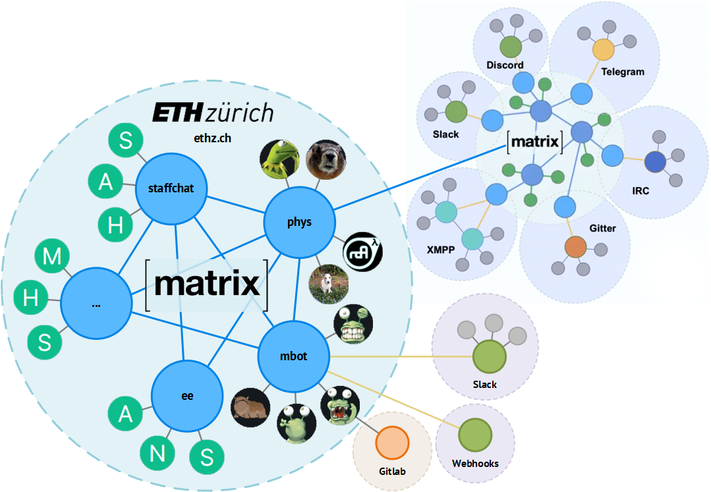

### Matrix: Das Ende des Messenger-Wahnsinns?

<!-- .element height="50%" width="50%" -->

von Moritz Stückler ([Twitter](https://twitter.com/MoStueck), [GitHub](https://github.com/pReya))

---
> „Matrix is an open network for secure, decentralised, real-time communication."

---
### Was ist Matrix?
- Protokoll/Standard (KEIN Messenger!)
- Gestartet in 2014 (2019 stable)
- Open Source
- Hauptsächlich Messaging (aber auch Video/Audio, IoT, M2M, föderierte Datenbank)
- Föderiert (> dezentralisiert)

---
### Welche Probleme löst es?
- Fragmentierung der Messenger-Welt
- Verschlüsselung und Datenhoheit
- Single Point of Failure / Zentralisierung / Zensur

---
### Kategorisierung von Messengern
|                 | IRC  | Telegram, WhatsApp, Signal | Slack, Discord | Matrix |
|-----------------|------|----------------------------|----------------|--------|
| Clientwahl      | Ja   | Nein                       | Nein           | Ja     |
| Dezentral       | Ja   | Nein                       | Nein           | Ja     |
| Föderiert       | Nein | Nein                       | Nein           | Ja     |
| Raumverzeichnis | Ja   | Nein                       | Ja             | Ja     |
| Verschlüsselt   | Nein | Teils                      | Nein           | Ja     |

---
### Structure overview

---
### Analogie: E-Mail
Alle E-Mail-Nutzer können sich Mails schicken – egal ob Gmail, Yahoo oder GMX -> genau so bei Matrix: alle Nutzer können miteinander schreiben, egal wo ihr Account liegt

|          | E-Mail              | Matrix                             |
|----------|---------------------|------------------------------------|
| Protocol | SMTP, IMAP          | Matrix                             |
| Server   | Mailserver          | Homeserver                         |
| Client   | Apple Mail, Outlook | Element, FluffyChat, Hydrogen      |
| IDs      | E-Mail address      | MXID                               |
| Provider | GMX, Gmail          | matrix.org, tchncs.de, mozilla.org |

<!-- ---
### How does it compare to...?
- IRC: Only decentralised, not federated (need to connect to specific servers/communities)
- Telegram, WhatsApp, Signal, Threema:
  - Only one single client app (no choice)
  - Centralised servers (privacy)
  - Nested room structures instead of single groups
  - Room directory to find rooms
- Slack / Discord:
  - Only one single client app (no choice
  - Centralised servers (privacy)
  - Instances can't be connected with each other -->

---
### Who uses it?
- Universities (ETH Zürich, Uni Hannover, Heidelberg, Berlin, and more)
- Governments and agencies (German Bundeswehr, France, State of Schleswig-Holstein)
- Open Source Communities (Mozilla, Gitter, KDE, and more)

---
### How can I use it?
- Use any public server (e.g. matrix.org)
- Most popular server: Synapse (Python)
- Most popular client: Element (ehemals Riot.im)
  - Multi-Platform (Web, Windows, Mac, Linux, Android, iOS)
  - https://app.element.io/
