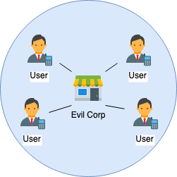

### Matrix: Das Ende des Messenger-Wahnsinns?

<!-- .element height="30%" width="30%" -->

von Moritz Stückler  
[Twitter (@MoStueck)](https://twitter.com/MoStueck) 
[Mastodon (@preya@mastodon.social)](https://mastodon.social/@preya) 
[GitHub (pReya)](https://github.com/pReya)

---
> „Matrix is an open network for secure, decentralised, real-time communication.“
>
*Quelle: matrix.org*

---
### Was ist Matrix?
- Protokoll/Standard (KEIN Messenger!)
- Gestartet in 2014 (2019 stable)
- Open Source
- Hauptsächlich Messaging (aber auch Video/Audio, IoT, M2M, föderierte Datenbank)
- Föderiert (> dezentralisiert)

---
### Welche Probleme löst es?
- Fragmentierung der Messenger-Welt
- Verschlüsselung und Datenhoheit
- Single Point of Failure / Zentralisierung / Zensur

Note:
Kurzer Überblick über die Kategorisierung von Messengern

---
### Zentralisiert

z.B. WhatsApp, Telegram, Signal, Slack, Discord

---
### Dezentralisiert

z.B. Mattermost, Rocket.Chat, IRC

---
### Dezentralisiert + Föderiert

z.B. XMPP, Matrix

<!-- .element height="500px" -->

---
### Kategorisierung von Messengern
|                 | IRC  | Telegram, WhatsApp, Signal | Slack, Discord | Matrix |
|-----------------|------|----------------------------|----------------|--------|
| Dezentral       | ✅   | ❌                          | ❌             | ✅     |
| Föderiert       | ❌   | ❌                          | ❌             | ✅     |
| Clientwahl      | ✅   | ❌                          | ❌             | ✅     |
| Räume           | ✅   | ❌                          | ✅             | ✅     |
| Verschlüsselt   | ❌   | Teils                       | ❌             | ✅     |

Note:
Noch ein paar weitere Kritierien:
- Verschiedene Clients möglich
- Räume oder monothematisch
- End to End Verschlüsselung

Um Föderation in der Praxis zu verstehen: Analogie E-Mail
---
### Analogie: E-Mail

<strong>Alle</strong> E-Mail-Nutzer können sich Mails schicken – egal ob Gmail, Yahoo oder GMX  <strong>Alle</strong> Matrix-Nutzer können miteinander schreiben, egal wo ihr Account liegt

|           | E-Mail              | Matrix                             |
|-----------|---------------------|------------------------------------|
| Protokoll | SMTP, IMAP          | Matrix                             |
| Server    | Mailserver          | Homeserver                         |
| Client    | Apple Mail, Outlook | Element, FluffyChat, Hydrogen      |
| IDs       | E-Mail-Adresse      | MXID                               |
| Anbieter  | GMX, Gmail          | matrix.org, tchncs.de, mozilla.org |

---
### Wer setzt es ein?
- Universitäten (ETH Zürich, Uni Hannover, Heidelberg, Berlin)
- Regierungen und Behörden (Bundeswehr, Franz. Regierung, Land Schleswig-Holstein, Gematik)
- Open Source Communities (Mozilla, Gitter, KDE)

---
### Wie kann ich loslegen?
- **Du musst keinen Server aufsetzen!**
- Nutze öffentliche Server (z.B. matrix.org)
- Beliebtester Client: Element
  - Multi-Platform (Windows, Mac, Linux, Android, iOS)
  - oder Web: https://app.element.io/

---
### Matrix @ VOW
- Eigener Homeserver
- Eigene Element-Instanz
- Anmeldung über VOW-Account

<a href="https://vow.chat/">vow.chat</a>

