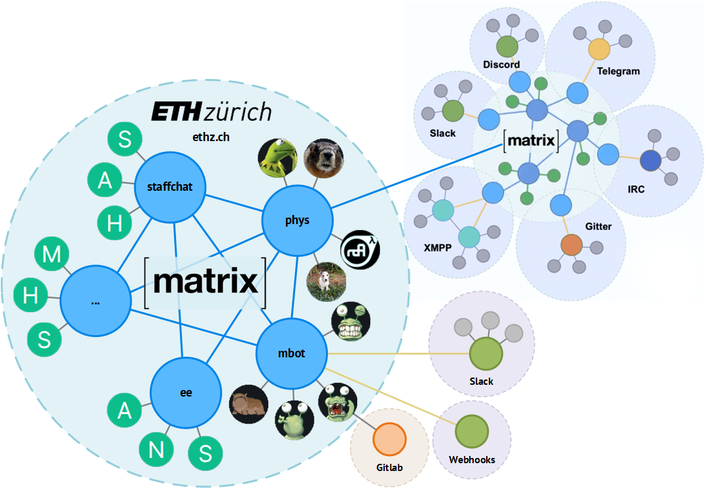

### Matrix: One messenger to rule them all?

<!-- .element height="50%" width="50%" -->

by Moritz Stückler ([Twitter](https://twitter.com/MoStueck), [GitHub](https://github.com/pReya))

---
> „Matrix is an open network for secure, decentralised, real-time communication."

---
### What is Matrix?
- Started in 2014 (2019 stable)
- Open Source
- Protocol/Standard (NOT a messenger)
- Based on HTTP & JSON
- Messaging (but also Video/Audio, IoT, M2M, federated databse)
- federated (> decentralised)

---
### Which problems can it solve?
- Fragmentation of the messenger world
- E2E encryption and data ownership
- Single Point of Failure / Centralisation / Censorship

---
### Structure overview

---
### Analogy: E-Mail
All E-Mail users can send mails to each other, no matter if they use Gmail, Yahoo or GMX -> same for Matrix: users can talk to each other no matter, which server they use

|          | E-Mail              | Matrix                             |
|----------|---------------------|------------------------------------|
| Protocol | SMTP, IMAP          | Matrix                             |
| Server   | Mailserver          | Homeserver                         |
| Client   | Apple Mail, Outlook | Element, FluffyChat, Hydrogen      |
| IDs      | E-Mail address      | MXID                               |
| Provider | GMX, Gmail          | matrix.org, tchncs.de, mozilla.org |

---
### How does it compare to...?
- IRC: Only decentralised, not federated (need to connect to specific servers/communities)
- Telegram, WhatsApp, Signal, Threema:
  - Only one single client app (no choice)
  - Centralised servers (privacy)
  - Nested room structures instead of single groups
  - Room directory to find rooms
- Slack / Discord:
  - Only one single client app (no choice
  - Centralised servers (privacy)
  - Instances can't be connected with each other

---
### Comparison
|                | IRC | Telegram, WhatsApp, Signal | Slack, Discord | Matrix |
|----------------|-----|----------------------------|----------------|--------|
| Client Choice  | Yes | No                         | No             | Yes    |
| Decentralised  | Yes | No                         | No             | Yes    |
| Federated      | No  | No                         | No             | Yes    |
| Room Directory | Yes | No                         | Yes            | Yes    |
| Nested Rooms   | No  | No                         | No             | Yes    |
| E2EE           | No  | Partially                  | No             | Yes    |

---
### Who uses it?
- Universities (ETH Zürich, Uni Hannover, Heidelberg, Berlin, and more)
- Governments and agencies (German Bundeswehr, France, State of Schleswig-Holstein)
- Open Source Communities (Mozilla, Gitter, KDE, and more)

---
### How can I use it?
- Use any public server (e.g. matrix.org)
- Most popular server: Synapse (Python)
- Most popular client: Element (ehemals Riot.im)
  - Multi-Platform (Web, Windows, Mac, Linux, Android, iOS)
  - https://app.element.io/
