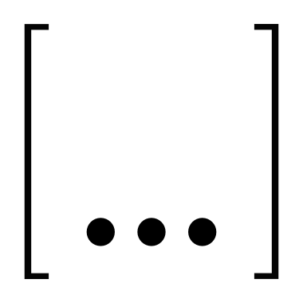
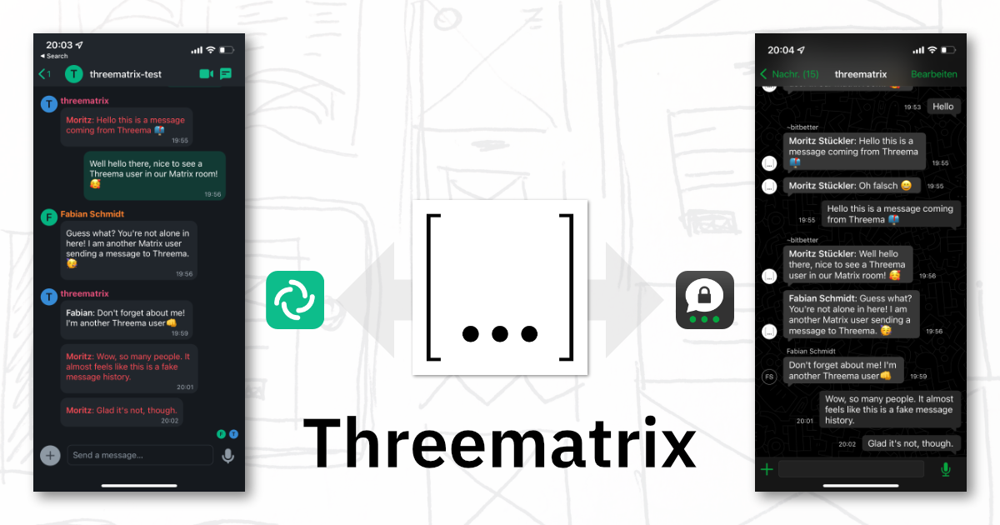
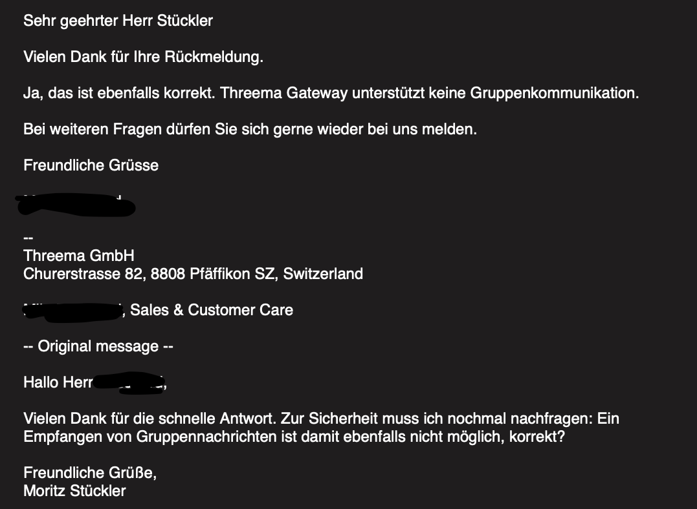

# How we built an Open Source Threema/Matrix bridge –   and got paid for it

<!-- .element height="200px" -->

> Matrix Community Summit 
> Berlin – 26.8.2022

Note:
- Photos are okay
- Project is Alpha – don't expect too much

---

## Live Demo

<!-- .element height="350px" -->

Join us at 

[#threematrix-summit:fabcity.hamburg](https://matrix.to/#/#threematrix-summit:fabcity.hamburg)

---

### We? Who?

  

    
    <strong>Fabian</strong> 
    Fullstack Developer 
    Law firm
  

  

    
    <strong>Moritz</strong> 
    Fullstack Developer 
    Freelancer 
    @moritz:fabcity:hamburg
  

- 📚 Met 2014 at university in Hamburg
- 💼 Started a company together: [bitbetter](https://bitbetter.de/)

Note:

---

### Threema?
- 📱 App Messenger similar to WhatsApp, Telegram
- 🔐 Focus on Privacy, Anonymity (no phone number required)
- 🇨🇭 Swiss company, started in 2012
- ~30 employees
- 10 Mio users (06/21)
- Open Source (Clients)
- 💵 Paid app (4,99€)

Note:
- Quick recap on Threema
- Only clients are open source

---

### Why?
- 🪚 Threema: Messenger for our [makerspace](https://www.welcome-werkstatt.de/) (70 ppl)
- ❌ Discoverability (No Room Directory)
- ❌ Only one Admin per group
- ❌ No (easy) automation/integration
- ✅ Easy to use

Note:
- A lot of seniors/non-tech people
- Long-term: Migrate to Matrix
- Ease the migration: let's build a bridge
- But: would be nice to get paid for it (helps prioritization)
- Advertisement section

---

### Enter: Prototype Fund

- 🗓 6 months funding for OSS "Public Interest Tech"
- 🏤 Money from Federal Ministry of Education and Research (BMBF)
- Up to [47.500€ in 6 months](https://prototypefund.de/)
- ⏱ Funding is based on time estimation: 50€/hr <!-- .element: class="fragment" -->
- For us: 300hrs estimate = 15.000€ funding <!-- .element: class="fragment" -->

Note:
- Can be more than 50€/hr
- Fantastic vehicle, no strings attached
- Funded Matrix projects before
- Funding secured -> planning how to achieve this

---

### Threema's Business Model
- 😤 No open/free API like Telegram/Signal <!-- .element: class="fragment" -->
- Instead: Threema Gateway (Paid API product) <!-- .element: class="fragment" -->
  - 65€ setup fee
  - Manual approval process for new customers
  - 2-5ct per outgoing message
  - Group message = direct message to every member
- 20 msgs/day to 70 people = 1400 msgs (💸&nbsp;28-70€ per day) <!-- .element: class="fragment" -->

=> ❌ No good match for a messenger bridge

Note:
- Imagination: Search for open API, get coding, be done with it
- Turns out: It's not that easy
- Can't control the costs b/c it's up to the group

---

### Moral dilemma
- Why not reverse engineer the client? <!-- .element: class="fragment" -->
  - We ❤️ Threema and Open Source
  - Making money with OSS is hard
  - Our bridge uses their infrastructure
  - Bridge allows automation -> possibly heavier usage than App
- "Client mode": We rip them off <!-- .element: class="fragment" -->
- "Gateway mode": They rip us off <!-- .element: class="fragment" -->

---

### How do we solve it?
- Talked to 👨🏻‍💼 Threema CEO about it <!-- .element: class="fragment" -->
  - Understood our problem 👊
  - Don't hate our project 🥳
  - Gave us credits for testing 🙏
- They will think about solutions <!-- .element: class="fragment" -->
  - Maybe change their pricing model
- No promises though – nothing might happen <!-- .element: class="fragment" -->

=> How do we proceed?

Note:
- Discussion/input afterwards appreciated
- Would like to find middle ground
- Plan for the future:
  - Gateway API for now
  - Wait for a) Threema b) Matrix SDK Maturity
  - Implement "client" solution later

---

### Implementation Phase
- Multiple SDKs/Languages on both sides of the bridge
- Official Threema Gateway SDKs not very active, but functioning
- 🦀 Rust seemed to be the most future-proof choice

Note:
- Exploration/Evaluation of SDKs took a long time
- Problem: We've never written any Rust -> started to learn

---
### Problems #1

<!-- .element height="500px" -->

---

### Problems #1
- 🤡 Threema Gateway product does not support group chats
  - But it actually does – it's just not documented
  - We implemented group logic ourselves (planning to upstream to `threema-gateway-rs`)

Note:
- Asked Threema support for Group chats -> Nope
- Threema employee gave us a hint
- Receive a message for group meta data
- Group text messages are just single messages

---

### Problems #2
- `matrix-rust-sdk` is still missing some features/buggy
  - Application Services Crate
    - E2EE is not stable
    - Can't set display names for virtual users
    - Initial state / sync is not supported, yet
    - For now: We're pausing App Service functionality

Note:
- Currently it's a bridge bot
- Would like to convert it to App Service and use Puppeteering

---

### Thanks!
- Follow us:
  - Matrix: [#threema-bridge:matrix.org](https://matrix.to/#/#threema-bridge:matrix.org)
  - GitHub: [github.com/bitbetterde/Threematrix](https://github.com/bitbetterde/Threematrix)
  - Mastodon: [@threematrix@mastodon.social](https://mastodon.social/@threematrix)

Note:
