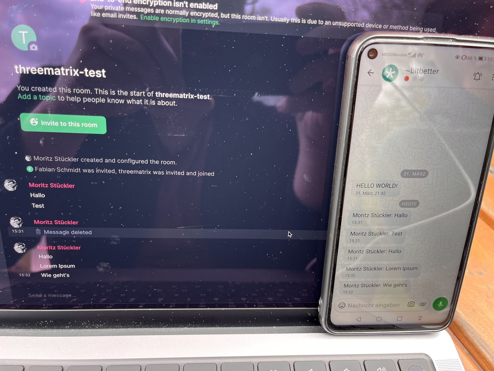

# Threematrix

<!-- .element height="200px" -->

> A bridge between the Threema Messenger and the Matrix network

*Status:* ☯️ There's good news and bad news

---

### Good news: Technically it works

---

### Bad news: Business models
- Threema is a swiss private company that wants to earn money
- Two ways to approach a bridge solution:
  - Use an existing, paid API product offered by Threema (👈 we've tried this until now – but it doesn't work)
  - "Fake" client application from reverse engineered OSS mobile App (🥈 we will try this now, but there is a risk, Threema won't like this approach)